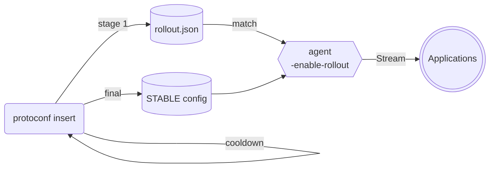

# Staged Rollouts

:::info New in v0.2.0
:::

A configuration change is a deploy. Staged rollouts let a config reach a small,
named slice of your fleet first, sit there for a cooldown, and only then widen —
so a bad value is caught by one canary rather than by every process at once.

## How it works

Three pieces cooperate:

1. **The compiler** materializes a config wrapped in a `ConfigRollout`, which
   carries an ordered list of stages.
2. **`protoconf insert`** walks those stages. For each one it publishes a
   `rollout.json` next to the config, then waits out that stage's cooldown
   before moving to the next. When the last stage completes, the config is
   promoted to `STABLE`.
3. **The agent**, started with `-enable-rollout`, watches both the stable config
   and `rollout.json`. It serves the first stage it matches, and falls back to
   the stable config otherwise.



## Declaring a rollout

Wrap the value your `main()` returns in `ConfigRollout` and describe the stages
with `RolloutStage`:

```python title=./src/myproject/server_config.pconf
load("//myproject/v1/server_config.proto", "ServerConfiguration")
load("//google/protobuf/duration.proto", "Duration")

def main():
    return ConfigRollout(
        value = ServerConfiguration(
            is_debug = False,
            max_connections = 2000,
        ),
        default_cooldown_time = Duration(seconds = 300),
        default_expiration_time = Duration(seconds = 3600),
        stages = [
            RolloutStage(channel = "canary"),
            RolloutStage(percentile = 10),
            RolloutStage(percentile = 50, cooldown = Duration(seconds = 900)),
        ],
    )
```

### Stage fields

| Field | Meaning |
| --- | --- |
| `channel` | Serve this stage to agents whose channel name matches |
| `percentile` | Serve this stage to a stable pseudo-random share (0–100) of agents |
| `cooldown` | How long the inserter waits before advancing past this stage. Falls back to `default_cooldown_time` |
| `expiration` | How long an agent holds this stage before accepting updates again. Falls back to `default_expiration_time` |

The `manual` and `labels` fields exist on `RolloutStage` but are not yet acted
on by the inserter or the agent.

`namespace` on the `ConfigRollout` itself routes the rollout to a specific
Kubernetes namespace when using the [ConfigMaps backend](./kubernetes.mdx).

## Targeting agents

An agent matches a stage in one of two ways.

**By channel.** The channel comes from the subscription request if the client
set one, otherwise from the agent's own `-channelName`:

```bash
protoconf agent -enable-rollout -channelName canary \
  -store etcd -store-address etcd:2379
```

**By percentile.** The agent hashes the config path together with its own
identity — its hostname — and takes that modulo 100. An agent below the stage's
`percentile` gets the stage. The hash is stable, so the same host keeps landing
in the same bucket for the same config across restarts, and different hosts
spread out evenly.

Because stages are evaluated in order, put your narrowest stage first.

## Running the rollout

`protoconf insert` drives the rollout, so it stays in the foreground for the
whole plan:

```bash
protoconf insert -store etcd -store-address etcd:2379 myproject/server_config
```

Interrupting the inserter — `Ctrl-C`, or a cancelled CI job — clears
`rollout.json`, which returns every agent to the stable config. An aborted
rollout leaves nothing half-applied behind.

Each stage is published with an `expires_at` computed from its expiration. An
agent that applies a stage holds that value until `expires_at` passes and only
then accepts further updates, so a stage lapses on its own instead of pinning a
slice of your fleet to a canary value indefinitely.

## Observing a rollout

An agent with `-enable-otel` reports which stage it applied through the
`protoconf_agent_config_version` metric, labelled with the config path, the
stage, and the commit and author of the change. See
[Observability](./observability.mdx).

## Limitations

`GetConfig`, the one-shot read added in v0.2.0, always returns the stable
config — it does not resolve rollout stages. Callers that need to observe a
rollout should subscribe with `SubscribeForConfig`.
